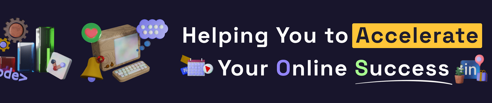

I’m a designer and full-stack developer. I help businesses grow their online presence and create impactful solutions that inspire and drive results.
 

⚒️ I’m currently working on POS for small business

🏫 I’m currently learning Data Analysis

🙋‍♂️ Ask me about: Product and Graphic Design, React, Back-End Development, Open Source and GitHub 

## 😎 Follow me
 
     

## 🚀 My Skills & Technologies  

### 🖥️ Frontend Development  
     
Experienced in building dynamic and interactive user interfaces with **React.js, Vue.js**, and **TypeScript**.  

### 🎨 UI/UX & Styling  
   
Skilled in **Tailwind CSS** and **Bootstrap** for crafting modern, responsive designs.  

### ⚙️ Backend & APIs  
    
Developing robust server-side applications and APIs using **Node.js (Express.js)** and **Python**.  

### 📦 Databases  
   
Experienced in working with **MongoDB** and **PostgreSQL** for scalable data management.  

### 🚀 DevOps & Tools  
   
Setting up CI/CD pipelines with **GitHub Actions** and containerizing applications using **Docker**.  

### 🛠️ Other Skills  
   
Working with **GraphQL**, API integrations, and UI/UX prototyping in **Figma**.  

🔹 **Experience**: Advanced frontend development, performance optimization, SEO, UX/UI design  
🔹 **Methodologies**: Agile, SCRUM, TDD  

My open src Projects

- **[Get-(sh)-It-Done](https://github.com/visualGravitySense/Get-sh-it-Done)**: Task Management System, is a productivity tool that integrates Obsidian and Telegram to streamline task management and enhance productivity.
- **[Crypto-dashboard](https://github.com/visualGravitySense/crypto-data)**: A cryptocurrency tracking app with an intuitive UI and data visualization.
- **[Job Scraping Server](https://github.com/visualGravitySense/digo_django)** This project is a web scraping server that collects job listings from local job search websites. It allows users to retrieve and analyze job postings programmatically.
- **[School Course Platform](https://github.com/visualGravitySense/auto-school)** This project is an open-source web application for a driving or another school, designed to manage course listings, scheduling, and enrollment. Built with modern web technologies, it supports multilingual content.
- **[Mood Gify](https://github.com/Kefirchik99/MoodGify-Front)**: A gif analyzer that detects the user's mood and suggests corresponding gifs.

 

# Looking for Collaborators on GitHub

I am actively looking for people interested in collaborative projects! If you're excited about working on innovative solutions in development, design, and technology, let's connect and build something great together.

> [!NOTE]  
> Important: I'm looking for developers with experience in **React**, **Vue.js**, **Node.js**, and other modern technologies, as well as designers and UX/UI specialists.

> [!TIP]  
> Additional Information: I would love to work with people who are eager to contribute to open-source projects and startups. My GitHub profile: [visualGravitySense](https://github.com/visualGravitySense).

> [!IMPORTANT]  
> Key Points: Please note that the main focus of the project is on **innovative design** and **user experience**, as well as using **modern frameworks and tools**.

  

#### 🧑‍🎓 My Completed Courses

    

#### Front-End Development

I successfully completed the Front-End Development course on GammaTest.

#### Data Analysis with Python and SQL

The course is currently in progress:

 

  
   
<!--    -->
  

 

<!--

-->

<!--
**visualGravitySense/visualGravitySense** is a ✨ _special_ ✨ repository because its `README.md` (this file) appears on your GitHub profile.

Here are some ideas to get you started:

- 🔭 I’m currently working on ...
- 🌱 I’m currently learning ...
- 👯 I’m looking to collaborate on ...
- 🤔 I’m looking for help with ...
- 💬 Ask me about ...
- 📫 How to reach me: ...
- 😄 Pronouns: ...
- ⚡ Fun fact: ...
-->
