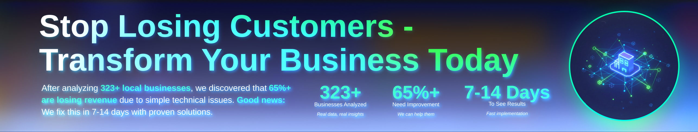

# 🚀 New Initiative Launch!
## I'm excited to announce the launch of my Designlytics platform - a comprehensive design analytics and optimization service!
🌐 Visit the Platform
www.designlytics.ee

### 📊 What is Designlytics?
Designlytics is a cutting-edge platform dedicated to helping businesses and creators optimize their digital presence through data-driven design insights and analytics.

### ✨ Key Features:

- Design Analytics - Track and measure the impact of your design decisions
- Performance Metrics - Real-time insights into user engagement and behavior
- Optimization Tools - AI-powered recommendations for design improvements
- Visual Testing - A/B testing and multivariate analysis for design elements

### 📬 Contact Me
  
  

---

*⭐ If you find my work valuable, consider starring my repositories and sharing with others who might benefit!*

<!--  -->

<!--
**visualGravitySense/visualGravitySense** is a ✨ _special_ ✨ repository because its `README.md` (this file) appears on your GitHub profile.

Here are some ideas to get you started:

- 🔭 I’m currently working on ...
- 🌱 I’m currently learning ...
- 👯 I’m looking to collaborate on ...
- 🤔 I’m looking for help with ...
- 💬 Ask me about ...
- 📫 How to reach me: ...
- 😄 Pronouns: ...
- ⚡ Fun fact: ...
-->
