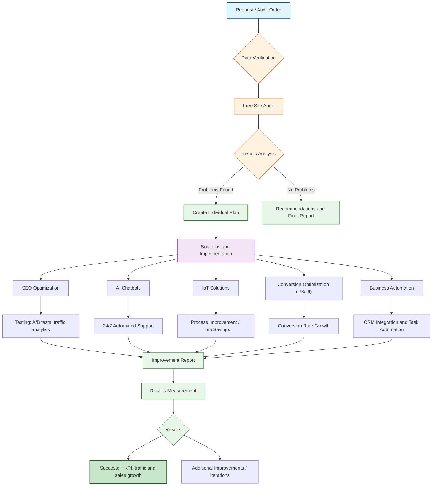

# 🚀 New Initiative Launch!

### *Data-driven design insights for your digital presence*

---

## 📊 What is Designlytics?

> Designlytics is a **cutting-edge platform** dedicated to helping businesses and creators optimize their digital presence through data-driven design insights and analytics.

---

## ✨ Key Features

| Feature | Description |
| :--- | :--- |
| **📈 Design Analytics** | Track and measure the impact of your design decisions |
| **⚡ Performance Metrics** | Real-time insights into user engagement and behavior |
| **🤖 Optimization Tools** | AI-powered recommendations for design improvements |
| **🧪 Visual Testing** | A/B testing and multivariate analysis for design elements |

---

## 🔄 Workflow

---

## 📬 Contact Me

---

### ⭐ Support My Work

*If you find my work valuable, consider starring my repositories and sharing with others who might benefit!*

---

### 🎨 Creative Projects

**[Expression Generative Art](https://github.com/visualGravitySense/stable-dif)** — Next generation creative avatars

