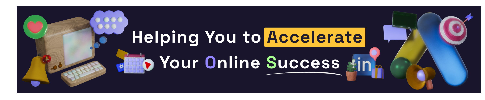

> [!NOTE]  
> Looking for Collaborators on GitHub for people interested in collaborative projects! If you're excited about working on innovative solutions in development, design, and technology, let's connect and build something great together.
>
> I’m a designer and full-stack developer. I help businesses grow their online presence and create impactful solutions that inspire and drive results.
> 
> ⚒️ I’m currently working on POS for small business

## 😎 Follow me
 
     

> [!TIP]
>     
       
> Experienced in building dynamic and interactive user interfaces with **React.js, Vue.js**, and **TypeScript**. Skilled in **Tailwind CSS** and **Bootstrap** for crafting modern, responsive designs.   Additional Information: I would love to work with people who are eager to contribute to open-source projects and startups. My GitHub profile: [visualGravitySense](https://github.com/visualGravitySense).
> 🙋‍♂️ Ask me about: Product and Graphic Design, React, Back-End Development, Open Source and GitHub 

## My open src Projects

- **[Job Scraping Server](https://github.com/visualGravitySense/digo_django)** This project is a web scraping server that collects job listings from local job search websites. It allows users to retrieve and analyze job postings programmatically.
- **[Mood Gify](https://github.com/Kefirchik99/MoodGify-Front)**: A gif analyzer that detects the user's mood and suggests corresponding gifs.
- **[Get-(sh)-It-Done](https://github.com/visualGravitySense/Get-sh-it-Done)**: Task Management System, is a productivity tool that integrates Obsidian and Telegram to streamline task management and enhance productivity.

<!--  -->

 

> [!IMPORTANT]  
> ### My open Guides
> **[GitHub Mastery Guide](https://github.com/visualGravitySense/GitHub-Mastery-Guide)** GitHub Mastery Guide: Setup, Achievements, and Promotion 📌 Key Topics: Profile Setup, Achievements, SEO, Content, Community

  

<!--
**visualGravitySense/visualGravitySense** is a ✨ _special_ ✨ repository because its `README.md` (this file) appears on your GitHub profile.

Here are some ideas to get you started:

- 🔭 I’m currently working on ...
- 🌱 I’m currently learning ...
- 👯 I’m looking to collaborate on ...
- 🤔 I’m looking for help with ...
- 💬 Ask me about ...
- 📫 How to reach me: ...
- 😄 Pronouns: ...
- ⚡ Fun fact: ...
-->
